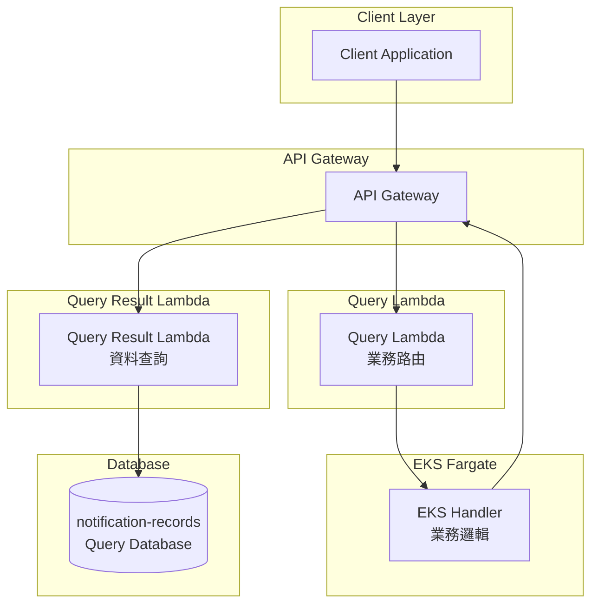

# Query Service v4

**CQRS 查詢服務 - 專注於高效的交易推播記錄查詢**

## 概述

Query Service v4 是基於 CQRS (Command Query Responsibility Segregation) 架構模式的查詢服務，專門用於查詢推播通知記錄。本版本專注於以 `transaction_id` 為主鍵的高效查詢操作。

### 架構特點

- **六邊形架構 (Hexagonal Architecture)**: 清晰分離領域邏輯與基礎設施
- **CQRS 模式**: 分離讀寫操作，優化查詢效能
- **主鍵查詢優化**: 使用 `transaction_id` 作為主鍵，提供最佳查詢效能
- **事件驅動**: 通過 DynamoDB Stream 實現資料同步

## v4 新特性

### 🎯 核心改進

1. **簡化端點**: 移除低效的 scan 操作，只保留高效的主鍵查詢
2. **效能優化**: 所有查詢都基於 `transaction_id` 主鍵
3. **Schema 優化**: 新的資料結構更適合實際使用場景
4. **API 簡化**: 從 4 個端點簡化為 2 個核心端點

### 📋 可用端點

| 端點 | 方法 | 功能 | 查詢方式 |
|------|------|------|----------|
| `/tx` | GET | 交易推播記錄查詢 | 主鍵查詢 (`get_item`) |
| `/query/transaction` | POST | 交易推播記錄查詢 | 主鍵查詢 (`get_item`) |
| `/fail` | GET | 失敗推播記錄查詢 | 主鍵查詢或全表掃描 |
| `/query/fail` | POST | 失敗推播記錄查詢 | 主鍵查詢或全表掃描 |

### 🗂️ 資料 Schema (v4)

```json
{
  "transaction_id": "txn-12345",           // 主鍵
  "token": "device-token-abc123",
  "platform": "IOS|ANDROID|WEB",
  "notification_title": "推播標題",
  "notification_body": "推播內容",         // 必填欄位
  "status": "SENT|DELIVERED|FAILED",
  "send_ts": 1640995200,
  "delivered_ts": 1640995210,              // 可選
  "failed_ts": 1640995220,                 // 可選
  "ap_id": "mobile-app-001",
  "created_at": 1640995200
}
```

## API 使用說明

### 1. 交易推播記錄查詢

#### GET 方法 (推薦)
**端點**: `GET /tx?transaction_id=<id>`

**請求**:
```bash
curl "http://localhost:8000/tx?transaction_id=txn-12345"
```

#### POST 方法
**端點**: `POST /query/transaction`

**請求**:
```json
{
  "transaction_id": "txn-12345"
}
```

**回應**:
```json
{
  "success": true,
  "data": [
    {
      "transaction_id": "txn-12345",
      "token": "device-token-abc123",
      "platform": "IOS",
      "notification_title": "Payment Confirmation",
      "notification_body": "Your payment has been processed",
      "status": "DELIVERED",
      "send_ts": 1640995200,
      "delivered_ts": 1640995210,
      "ap_id": "payment-service",
      "created_at": 1640995200
    }
  ],
  "message": "Successfully retrieved notifications for transaction: txn-12345",
  "total_count": 1
}
```

### 2. 失敗推播記錄查詢

#### GET 方法 (推薦)

**查詢所有失敗記錄**:
```bash
curl "http://localhost:8000/fail"
```

**查詢特定交易的失敗記錄**:
```bash
curl "http://localhost:8000/fail?transaction_id=txn-67890"
```

#### POST 方法

**查詢所有失敗記錄**:
```json
{}
```

**查詢特定交易的失敗記錄**:
```json
{
  "transaction_id": "txn-67890"
}
```

**回應 (單一失敗記錄)**:
```json
{
  "success": true,
  "data": [
    {
      "transaction_id": "txn-67890",
      "token": "invalid-device-token",
      "platform": "ANDROID",
      "notification_title": "Login Alert",
      "notification_body": "New login detected",
      "status": "FAILED",
      "send_ts": 1640995400,
      "failed_ts": 1640995410,
      "ap_id": "auth-service",
      "created_at": 1640995400
    }
  ],
  "message": "Successfully retrieved failed notifications for transaction: txn-67890",
  "total_count": 1
}
```

**回應 (所有失敗記錄)**:
```json
{
  "success": true,
  "data": [
    {
      "transaction_id": "txn-failed-001",
      "status": "FAILED",
      "notification_title": "Account Alert",
      // ... 其他欄位
    },
    {
      "transaction_id": "txn-failed-002",
      "status": "FAILED",
      "notification_title": "Login Notification",
      // ... 其他欄位
    }
  ],
  "message": "Successfully retrieved failed notifications for all failed notifications",
  "total_count": 2
}
```

## 架構圖



## 效能特點

### 🚀 查詢效能

- **交易查詢**: `O(1)` - 使用主鍵直接查詢
- **特定失敗查詢**: `O(1)` - 主鍵查詢 + 狀態過濾
- **所有失敗查詢**: `O(n)` - 全表掃描 (建議加入 GSI 優化)
- **讀取單位**: 交易查詢通常只消耗 1 RCU，失敗查詢掃描會消耗較多 RCU
- **延遲**: 交易查詢 < 10ms，失敗查詢掃描取決於表格大小

### 📊 成本考量

- **交易查詢**: 成本極低，使用主鍵查詢
- **特定失敗查詢**: 成本極低，使用主鍵查詢
- **所有失敗查詢**: 成本較高，建議：
  - 生產環境建立 `status-created_at` GSI
  - 限制查詢頻率
  - 考慮加入分頁機制

## 開發與測試

### 本地開發

```bash
# 安裝依賴
poetry install

# 啟動服務
poetry run uvicorn eks_handler.main:app --reload --port 8000

# 運行測試
poetry run pytest -v

# 程式碼檢查
pre-commit run --all-files
```

### LocalStack 測試

```bash
# 啟動 LocalStack
docker-compose up -d localstack

# 設置測試環境
./infra/localstack/setup.sh

# 測試交易查詢 (GET)
curl "http://localhost:8000/tx?transaction_id=txn-test-001"

# 測試交易查詢 (POST)
curl -X POST http://localhost:8000/query/transaction \
  -H "Content-Type: application/json" \
  -d '{"transaction_id": "txn-test-001"}'

# 測試所有失敗記錄查詢 (GET)
curl "http://localhost:8000/fail"

# 測試特定失敗記錄查詢 (GET)
curl "http://localhost:8000/fail?transaction_id=txn-failed-001"

# 測試失敗記錄查詢 (POST)
curl -X POST http://localhost:8000/query/fail \
  -H "Content-Type: application/json" \
  -d '{"transaction_id": "txn-failed-001"}'
```

### 日誌追蹤

現在所有端點都提供詳細的日誌追蹤：

```json
{
  "timestamp": "2024-01-15T10:30:00Z",
  "level": "INFO",
  "service": "query-lambda",
  "version": "4.0.0",
  "transaction_id": "txn-12345",
  "operation": "query_transaction",
  "method": "GET",
  "path": "/tx",
  "duration_ms": 15,
  "status": "success",
  "aws_request_id": "abc-123-def"
}
```

## 版本歷史

### v4.0.0 (當前版本)
- ✅ 簡化端點至 2 個核心查詢功能
- ✅ 支援 GET 和 POST 兩種方法
- ✅ 主鍵查詢優化，提升效能
- ✅ 失敗查詢支援全表掃描和特定交易查詢
- ✅ 新的資料 Schema 結構
- ✅ 詳細的日誌追蹤功能
- ✅ 移除低效的不必要 scan 操作

### v3.0.0
- 支援 4 種查詢類型
- EKS Fargate 部署
- 完整的六邊形架構

### v2.0.0
- 引入 CQRS 架構
- DynamoDB Stream 整合

### v1.0.0
- 基礎查詢服務
- Lambda 單體架構

## 技術棧

- **後端**: Python 3.12, FastAPI, AWS Lambda Powertools
- **資料庫**: Amazon DynamoDB
- **部署**: AWS EKS Fargate, AWS Lambda
- **監控**: CloudWatch, X-Ray
- **測試**: pytest, LocalStack
- **CI/CD**: GitHub Actions, pre-commit

## 授權

本專案使用 MIT 授權條款。
